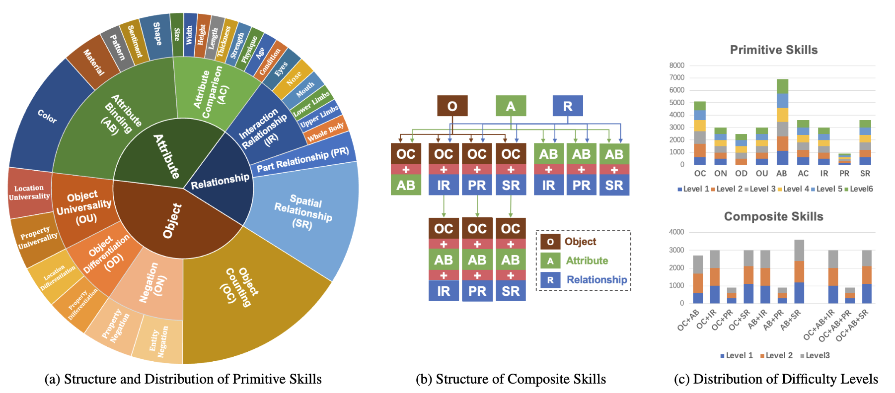
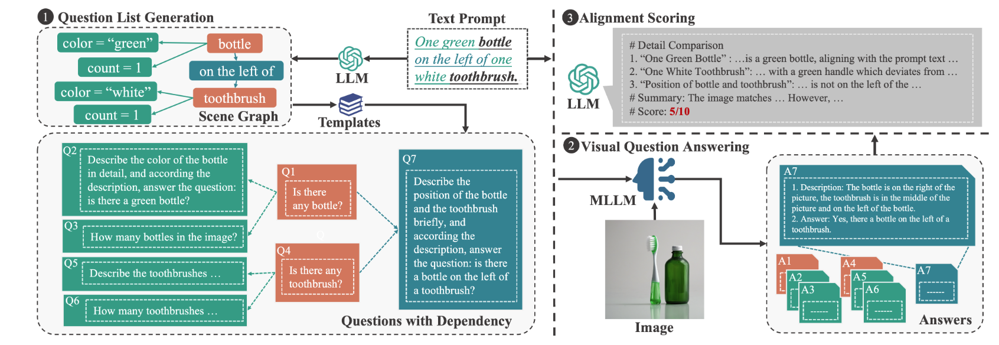

# OmniBench: A Comprehensive and Scalable Benchmark for Fine-grained Compositional Text-to-Image Generation

<!-- Name<sup>1</sup>, Name<sup>1</sup>,Name<sup>3</sup>, Name<sup>2</sup>.

**<sup>1</sup>HDU, <sup>2</sup>, <sup>3</sup>** -->

<!-- <a href=''></a>
<a href=''></a> 
<a href=''></a>  -->


## **OmniBench**

You can find the entire dataset in the `data/` directory, where each skill has multiple JSON files corresponding to different levels.
The directory structure inside `data/` is as follows:
```
├── primitive/
│   ├── AB_color/
│   │   ├── level_1.json
│   │   ├── level_2.json
│   │   └── ...
│   ├── AB_pattern/
│   │   ├── level_1.json
│   │   ├── level_2.json
│   │   └── ...
│   └── ...
└── composite/
    ├── AB_PR/
    │   ├── level_1.json
    │   ├── level_2.json
    │   └── ...
    ├── OC_IR/
    │   ├── level_1.json
    │   ├── level_2.json
    │   └── ...
    └── ...
```
Each json file contains a specific prompt for a given skill level and related information, with the following structure:
```python
{
    "0": {  # Prompt ID in this level
        "objects": [  # Objects in the prompt
            "apple"  
        ],
        "tags": {  # Additional information for prompt
            "objects number": 1 
        },
        "prompt": "A red apple."  # Prompt sentence
    },
    "1": {
        ...
    },
    ...
}
```

The file `evaluate/data_loader.py` provides a dataset loading method that we recommend using. You can use it to conveniently iterate through the data of a specific skill.However, you are completely free to implement your own approach.

## **Evaluation**
Our evaluate method consists of three steps: Question List Generation, VQA with MLLM, and the final alignment scoring using LLM.



#### 1. Question List Generation

In this step, our focus is on generating the scene graph based on the prompt. For details, refer to `evaluate/sg_generate.py`. The question list is closely related to the scene graph, and it can be derived by applying simple template-based transformations(For details, refer to `evaluate/qa_evaluate.py`, specifically the function`create_question(scene_graph_json, skill)`). Therefore, we do not explicitly store a question list file; instead, the question list is dynamically generated from the scene graph during the VQA process.
#### 2. VQA
We have defined a basic QA framework in `evaluate/qa_evaluate.py`. You can implement the QA process based on your chosen vision model and specific file directory.

Here are some recommended open-source MLLM repositories:

- [mPLUG-Owl3](https://github.com/X-PLUG/mPLUG-Owl/tree/main/mPLUG-Owl3)
- [Qwen2-VL](https://github.com/QwenLM/Qwen2.5-VL)
- [LLaVA-NeXT OneVision](https://github.com/LLaVA-VL/LLaVA-NeXT/blob/main/docs/LLaVA_OneVision_Tutorials.ipynb)
（You can also explore other MLLM models.）

#### 3. Alignment Scoring

In `evaluate/llm_evaluate.py`, you can find the prompt templates and overall code framework used for the final alignment scoring with LLM. In our implementation, we use gpt-3.5-turbo with temperature=0.8. We encourage experimenting with other LLM models and parameters. If you need to modify them, you can do so in `evaluate/chat_completions.py`.
If you want to read integer scores from the result file, refer to `def read_score(llm_eva_output_path)` in `evaluate\data_loader.py`.


